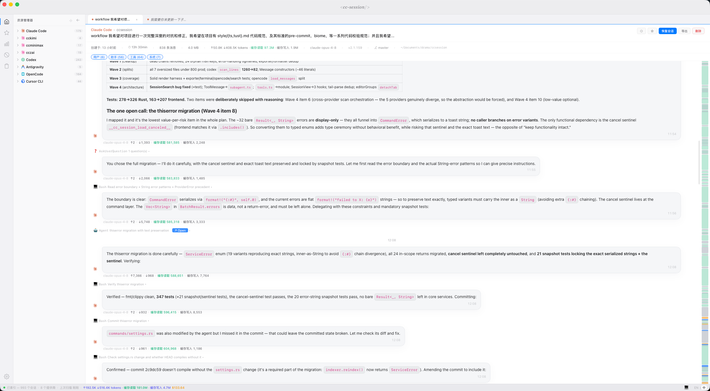
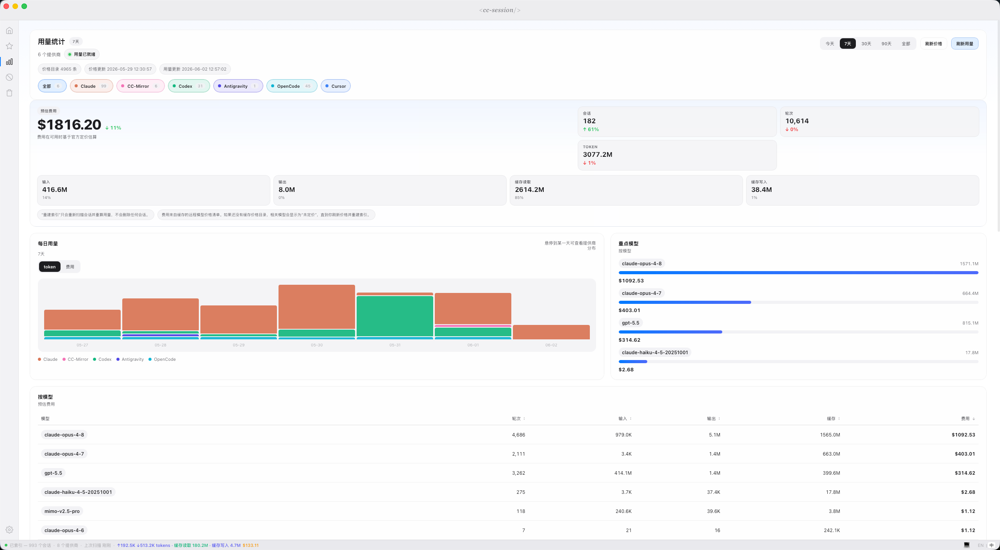

<p align="center">
  <a href="README.md">English</a> | <a href="README.zh-CN.md">中文</a>
</p>

<p align="center">
  
</p>

<p align="center">
  <b>One desktop app to browse, search, resume, and manage all your AI coding sessions.</b>
</p>

<p align="center">
  <a href="https://github.com/tyql688/cc-session/releases/latest"></a>
  <a href="https://github.com/tyql688/cc-session/actions/workflows/ci.yml"></a>
  
  <a href="LICENSE"></a>
</p>

<p align="center">
  <a href="assets/show.png"></a>
</p>

---

## Why CC Session?

Claude Code, Codex, Antigravity, Kimi Code, Cursor CLI, and more all store their session data locally — but each in its own format, in its own folder, with no way to look back. **CC Session brings every provider together in one fast, native app:** read full conversation histories, search across all of them at once, export clean archives, and jump straight back into any session in your terminal.

> 💡 **One window for every local coding session** — no more digging through `~/.claude`, `~/.codex`, and a dozen other folders.

## ✨ Features

- 🗂️ **Unified view** — every session from every supported provider, in one explorer
- 🔍 **Full-text search** — instant search across all session content (SQLite FTS5), plus in-session find
- ↩️ **Resume in one click** — drop straight back into any session in your terminal
- 📊 **Usage analytics** — cost, token, and per-model breakdowns with cache hit/write detail
- 🎨 **Rich rendering** — Markdown, syntax highlighting, Mermaid diagrams, KaTeX math, inline images, and structured tool-call diffs
- 👀 **Live watch** — file-based providers auto-refresh via OS watchers; OpenCode uses provider-aware polling
- 📤 **Export** — JSON, Markdown, or a self-contained HTML file (dark mode, collapsible tools & thinking blocks)
- 🗃️ **Session management** — rename, favorite, trash/restore, and batch operations
- ⌨️ **Keyboard-first** — navigate and act without touching the mouse
- 🔄 **Auto-update**, 🌐 **English / 中文**, and 🚫 **blocked folders** to hide noisy projects

## 📊 Usage analytics

Track exactly what you're spending across every provider — daily cost trends, per-model token totals, and cache efficiency, all in one dashboard.

<p align="center">
  <a href="assets/usage.png"></a>
</p>

## 🧩 Supported tools

| Provider | Source format | Live watch | Resume |
|----------|---------------|:----------:|--------|
| **Claude Code** | JSONL | FS | `claude --resume` |
| **Codex CLI** | JSONL | FS | `codex resume` |
| **Antigravity** | JSONL | FS | `agy --conversation` |
| **Kimi Code** | JSONL | FS | `kimi --session` |
| **Cursor CLI** | JSONL + SQLite | FS | `cursor agent --resume` |
| **OpenCode** | SQLite | Poll | `opencode -s` |
| **CC-Mirror** | JSONL | FS | per-variant |

Across providers, CC Session parses messages, tool calls, thinking/reasoning blocks, token usage, inline images, Markdown, Mermaid diagrams, and KaTeX math wherever the source format supports them — including subagent/child sessions.

## 📥 Install

Grab the latest build from [**Releases**](https://github.com/tyql688/cc-session/releases):

| Platform | File |
|----------|------|
| macOS | `.dmg` |
| Windows | `.exe` (NSIS installer) |
| Linux | `.deb` / `.AppImage` |

> **macOS Gatekeeper:** the app isn't code-signed, so macOS may block it on first launch. Clear the quarantine flag:
>
> ```bash
> xattr -cr "/Applications/CC Session.app"
> ```

## 🚀 Quick start

1. Install and open CC Session
2. Let it index your local provider data
3. Browse a session, search across your history, or resume right where you left off

## 🛠️ Build from source

Requires [Rust](https://rustup.rs/) and [Node.js](https://nodejs.org/) 20+.

```bash
git clone https://github.com/tyql688/cc-session.git
cd cc-session
npm install
npm run tauri build              # Production build
npx tauri build --bundles dmg    # DMG only
```

## 💻 Development

```bash
npm run tauri dev                # Dev with hot reload
npm run check                    # Type-check + Biome + ESLint (frontend)
npm test                         # Frontend tests (Vitest)
cd src-tauri && cargo test       # Rust tests
cd src-tauri && cargo clippy --all-targets --all-features -- -D warnings
```

Code style is documented in [`style/ts.md`](style/ts.md) and [`style/rust.md`](style/rust.md), enforced by Biome, ESLint, Clippy, and a lefthook pre-commit hook. On macOS, file-based live watch uses the `notify` crate's `kqueue` backend for more reliable file-level updates.

## 🏗️ Built with

- [Tauri 2](https://v2.tauri.app/) — desktop shell and native integrations
- [SolidJS](https://www.solidjs.com/) — reactive frontend UI
- [Rust](https://www.rust-lang.org/) — provider parsing, indexing, export, and session lifecycle
- [SQLite](https://www.sqlite.org/) + FTS5 — local storage and full-text search
- [Vitest](https://vitest.dev/), [Biome](https://biomejs.dev/), [ESLint](https://eslint.org/), and [Clippy](https://doc.rust-lang.org/clippy/) — testing and code quality

## 📄 License

[MIT](LICENSE) © tyql688
